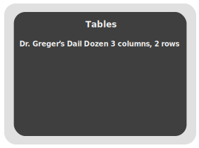

# Day 36 - Setting the table

Welcome to day 36!

Tables have gotten a bad rap. The reason is historical and a result of developers and designers not having a good, or early on, any layout system to speak off. As a result, people laid out entire web pages using tables. When using tables to represent data, however, they are a potent tool. If used correctly, they can also help users of assistive technologies to understand and navigate complex data.

So, without further ado, let's get to it.

## the `table` element

At its most basic, a table is a collection of rows and columns. For example:

```html
<table>
  <tr>
    <td>Captain America: The First Avenger</td>
    <td>2011</td>
  </tr>
  <tr>
    <td>Iron Man</td>
    <td>2008</td>
  </tr>
</table>
```

[On Codepen.io](https://codepen.io/schalkneethling/pen/597ed7b6946abccc16f6d121fee944f2)

The above creates a table with two rows, each containing two columns.

## Captions

A screen reader user can pull up a list of all tables on the page. With our existing markup above, the screen reader cannot provide a synopsis of the table's data. On a page with multiple tables, screen reader users will not be able to use this navigational aid. They will instead have to move to each table and try to make sense of the data themselves.

This is where the `caption` element comes in. Captioning your tables can be beneficial to visual users as well. They can scan the page and find the table containing the data they are interested in quickly.

```html
<table>
  <caption>
    Dr. Greger’s Daily Dozen
  </caption>
  <tr>
    <td>Beans</td>
    <td>3 per day</td>
    <td>e.g. ½ cup cooked beans, ¼ cup hummus</td>
  </tr>
  <tr>
    <td>Berries</td>
    <td>1 per day</td>
    <td>½ cup fresh or frozen, ¼ cup dried</td>
  </tr>
</table>
```

[On Codepen.io](https://codepen.io/schalkneethling/pen/d59edf815c5b5832eb71976ebfba06c3)

With the `caption` in place, a screen reader can surface the table as shown in the screenshot below:



You can see how this would be useful for users of assistive technologies. Sometimes, however, you might have a heading element describing the table already so, adding the `caption` might be redundant. In these cases, you can use `aria-labelledby` to link the heading to the table.

```html
<h2 id="dailydozen-caption">Dr. Greger’s Daily Dozen</h2>
<table aria-labelledby="dailydozen-caption">
  <!-- rest of the table contents goes here -->
</table>
```

[On Codepen.io](https://codepen.io/schalkneethling/pen/d59edf815c5b5832eb71976ebfba06c3)

Another option is to wrap the `table` element inside a `figure` element and use the `figcaption` element to describe the table. In this instance, the `caption` should be ommited.

```html
<figure>
  <table>
    <!-- rest of the table contents goes here -->
  </table>
  <figcaption>Dr. Greger’s Daily Dozen</figcaption>
</figure>
```

[On Codepen.io](https://codepen.io/schalkneethling/pen/d59edf815c5b5832eb71976ebfba06c3)

> NOTE: Even though the last two methods associate a caption(title) with the table, using VoiceOver on macOS still does not surface these additional tables. With that in mind, it is recommended to use the `caption` element when possible.

If you need to provide a more verbose description of the table, it is best to precede the table with, for example, a paragraph element. You can then use the `aria-describedby` attribute to associate the paragraph with the table.

```html
<p id="dd-table-description">
  Dr. Greger’s Daily Dozen was developed based upon the best available balance
  of evidence. Rather than being a meal plan or diet in itself, it is simply a
  checklist to inspire you to include some of the healthiest foods in your diet.
  Each row lists a food, number of servings per day, and example servings.
  <a href="https://nutritionfacts.org/daily-dozen/">Read more</a>
</p>
<table aria-describedby="dd-table-description">
  <caption>
    Dr. Greger’s Daily Dozen
  </caption>
  <tr>
    <td>Beans</td>
    <td>3 per day</td>
    <td>e.g. ½ cup cooked beans, ¼ cup hummus</td>
  </tr>
  <!-- rest of the table data goes here -->
</table>
```

## Table headers

Currently, it is not clear what each column in our table represents. To remedy this, let’s add a table header.

```html
<table>
  <caption>
    Dr. Greger’s Daily Dozen
  </caption>
  <tr>
    <th>Type of food</th>
    <th>Servings per day</th>
    <th>Example serving</th>
  </tr>
  <tr>
    <td>Beans</td>
    <td>3 per day</td>
    <td>e.g. ½ cup cooked beans, ¼ cup hummus</td>
  </tr>
  <tr>
    <td>Berries</td>
    <td>1 per day</td>
    <td>½ cup fresh or frozen, ¼ cup dried</td>
  </tr>
</table>
```

The `th` element allows you to specify a table header for each column or a range of columns. Visually this also helps a user better understand the data presented. For screen reader users, this makes a big difference. Watch the videos below to see the difference between navigating a table without and with table headers.

### Without table headers

../assets/day36/voiceover-tables-no-header.mp4

### With table headers

../assets/day36/voiceover-tables-with-header.mp4

## Add scope

While these headers have an implicit scope of `col`, it is best practice to be explicit.

```html
<table>
  <caption>
    Dr. Greger’s Daily Dozen
  </caption>
  <tr>
    <th scope="col">Type of food</th>
    <th scope="col">Servings per day</th>
    <th scope="col">Example serving</th>
  </tr>
  <!-- rest of table goes here -->
</table>
```

## Table head and body

Let’s take this a step further and clearly distinguish between the head and body of the table.

```html
<table>
  <caption>
    Dr. Greger’s Daily Dozen
  </caption>
  <thead>
    <tr>
      <th scope="col">Type of food</th>
      <th scope="col">Servings per day</th>
      <th scope="col">Example serving</th>
    </tr>
  </thead>
  <tbody>
    <tr>
      <td>Beans</td>
      <td>3 per day</td>
      <td>e.g. ½ cup cooked beans, ¼ cup hummus</td>
    </tr>
    <!-- rest of table goes here -->
  </tbody>
</table>
```

[On Codepen.io](https://codepen.io/schalkneethling/pen/bfd65e2e5523dc786eefbb2aa807d0ae)

Table headers can be at the top of a table, on the side of a table, or both. Let’s look at a slightly more complex table and see how we correctly associate the headers with their data.

```html
<table>
  <caption>
    <p>
      What can we do personally to reduce emissions? We need to get average
      yearly global emissions per person down to 2.1 tonnes CO2e.
    </p>
  </caption>
  <thead>
    <tr>
      <th scope="colgroup" colspan="2">Genuinely impactful actions</th>
      <th scope="col">Tonnes of CO2e saved per year</th>
    </tr>
  </thead>
  <tbody>
    <tr>
      <th scope="row">Action</th>
      <td>Drop the car</td>
      <td>-2.4</td>
    </tr>
    <tr>
      <th scope="row">Action</th>
      <td>Take fewer flights</td>
      <td>-1.6 per one roundtrip trans-atlantic flight</td>
    </tr>
    <!-- rest of table goes here -->
  </tbody>
</table>
```

> NOTE: Data from [Information Is Beautiful](https://informationisbeautiful.net/visualizations/what-can-we-do-personally-to-reduce-emissions/)

[On Codepen.io](https://codepen.io/schalkneethling/pen/bfd65e2e5523dc786eefbb2aa807d0ae)

In the code snippet from the above table, I used another new attribute, `colspan`. Each row in our table body contains three columns. The head, however, only includes two. For this reason, we use the `colspan` attribute to make the first column header span across the first two columns. A screen reader will also announce this to the user.

Something else we need to do is to state that the first header not only spans two columns, but is also the header for the two columns below it. We do this by setting `scope="colgroup"`.

```html
<tr>
  <th scope="colgroup" colspan="2">Genuinely impactful actions</th>
  <th scope="col">Tonnes of CO2e saved per year</th>
</tr>
```

In the body of the table, we have three columns, the first of which is marked up as a header. To indicate that it is the header for the current row, we add the `scope="row"` attribute.

> NOTE: Even with correct markup, screen reader users sometimes find it hard to navigate a table with header groups. If at all possible, try to simplify the table to avoid the need for header groups. Also, historically, screen reader support for `colgroup` is much better than `rowgroup`. If possible, try to orient the layout of your table such that the need for `rowgroup` is not needed.

```html
<tr>
  <th scope="row">Action</th>
  <td>Take fewer flights</td>
  <td>-1.6 per one roundtrip trans-atlantic flight</td>
</tr>
```

## The `tfoot` element

The `tfoot` element, as its name suggests, is used as a footer for the table. An everyday use case for this element is to present aggregate data for the table. For example, the following table shows total cookie sales per week, with the footer giving totals for each relevant column.

```html
<table>
  <caption>
    Weekly cookie sales
  </caption>
  <thead>
    <tr>
      <th scope="column">Child Name</th>
      <th scope="column">Type of cookie</th>
      <th scope="column">Amount sold</th>
      <th scope="column">Dollar Amount</th>
    </tr>
  </thead>
  <tbody>
    <tr>
      <td>Jenny</td>
      <td>Chocolate Chip</td>
      <td>20 boxes</td>
      <td>$100.00</td>
    </tr>
    <tr>
      <td>Johny</td>
      <td>Chocolate Chip</td>
      <td>10 boxes</td>
      <td>$50.00</td>
    </tr>
  </tbody>
  <tfoot>
    <tr>
      <td colspan="2" scope="row">Totals</td>
      <td>30 boxes</td>
      <td>$150.00</td>
    </tr>
  </tfoot>
</table>
```

[On Codepen.io](https://codepen.io/schalkneethling/pen/2cfd49ea53c6f930dd4cd376de428efe?editors=1000)

## Grouping columns

The above elements and attributes give us a way to lay out data in a two dimensional grid as well as associate entries with their headers. However, it is often useful to group columns together. This is especially useful if you want to visually style some column groups differently from the rest of the table as a means of highlighting the information.

You can achieve a similar result by adding CSS classes to cells or targetting specific columns or rows but, a better means of acieving this is through the use of the `colgroup` and `col` elements.

> NOTE: If no CSS is applied to the `colgroup` or `col` elements, they will not appear visually in the browser.

Let’s take our last table of cookie sales and group the last two columns together.

```html
<table>
  <caption>
    Weekly cookie sales
  </caption>
  <colgroup>
    <col />
    <col />
    <col span="2" class="sales" />
  </colgroup>
  <thead>
    <tr>
      <th scope="column">Child Name</th>
      <th scope="column">Type of cookie</th>
      <th scope="column">Amount sold</th>
      <th scope="column">Dollar Amount</th>
    </tr>
  </thead>
  <tbody>
    <tr>
      <td>Jenny</td>
      <td>Chocolate Chip</td>
      <td>20 boxes</td>
      <td>$100.00</td>
    </tr>
    <tr>
      <td>Johny</td>
      <td>Chocolate Chip</td>
      <td>10 boxes</td>
      <td>$50.00</td>
    </tr>
  </tbody>
  <tfoot>
    <tr>
      <td colspan="2" scope="row">Totals</td>
      <td>30 boxes</td>
      <td>$150.00</td>
    </tr>
  </tfoot>
</table>
```

By using the CSS `sales` class, we can target the last two columns and apply a different style to them without being concerned with the individual elements in those groups.

```css
caption {
  font-size: 3rem;
  margin-bottom: 1rem;
}

table {
  border-collapse: collapse;
  border: 5px solid #212121;
  max-width: 1024px;
  width: 100%;
}

tbody tr:nth-child(odd) {
  background-color: #212121;
  color: #edecec;
}

th,
td {
  padding: 1rem;
}

.sales {
  background-color: #edecec;
  border: 1px solid #333;
  padding: 2rem 1rem;
}

tfoot td[scope="row"] {
  background-color: #3e5788;
  color: #d7e4fd;
}
```

You can see the end result of the above on [Codepen.io](https://codepen.io/schalkneethling/pen/98308ac850dcba43ebafa9f17828c7d9?editors=1100).
