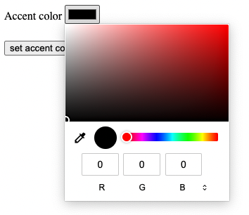

# Day 39 - Forms inputs

Welcome to day 39!

Having covered the `form` element, the `fieldset`, and `legend`, it is time to dig into the various `input` elements. There is quite a lot to cover here so let’s start by covering the `input` types.

## Input types

### Input type `hidden`

Our first type of `input` element is the `input` of type `hidden. As the name suggests, this `input`type has no visual representation so, we also do not need to add a`label` element. This element if often used to hold for example a CSRF token to protect against [cross-site request forgery](https://stackoverflow.com/questions/5207160/what-is-a-csrf-token-what-is-its-importance-and-how-does-it-work). But can hold any value that does not need to presented to the user or be editable by the user. For example:

```html
<input type="hidden" name="user-type" value="individual" />
```

There is a special value that can be used as the value of the `name` attribute of a hidden `input` field. This value is `_charset_`. When this value is specified, you need to omit the `value` attribute as it will automatically be assigned the value that [corresponds to submission character encoding](https://html.spec.whatwg.org/multipage/form-control-infrastructure.html#attr-fe-name-charset). For example, "utf8".

```html
<input type="hidden" name="_charset_" />
```

This could be useful information the server side code needs to know in order to process the data submitted appropriately.

> NOTE: Avoid using the names of built-in form properties such as `method` as the value of the `name` attribute. Because the input name takes precendence over built-in form properties, this can lead to what is known as [DOM clobbering](https://portswigger.net/web-security/dom-based/dom-clobbering), which is a security concern. See the [note in this section of the specification for a complete example](https://html.spec.whatwg.org/multipage/form-control-infrastructure.html#attr-fe-name-charset).

### Input type `text` and `search`

The next `input` type is `text`. Seeing that it is closely related to the input type `search`, I will cover both here. Both `text` and `search` presents the user with a input field that takes a single line of text. No line feed or carriage return is allowed.

```html
<label for="firstname">First name:</label>
<input type="text" name="firstname" id="firstname" />
<label for="search-term">Type your search query below</label>
<input type="search" name="q" id="search-term" />
```

The main difference with an `input` of `type` search is how some browser will display the field. For example, in Safari Desktop and Chromium based borwsers, the `input` of type `search` will display a small `x` icon as soon as you enter text into the field. When clicked, the `input` field will be cleared. This can be very useful for your end users.


With Safari on iOS, the `input` of type `search` will display a magnifying glass icon, but no `x` icon.


### Input type `tel`

The `input` of `type` tel is particularly useful on mobile devices. When on a mobile device, the `input` of type `tel` will display a number keypad that allows the user to enter a phone number. Greatly enhancing the user experience.


```html
<label for="telephone">Telephone number</label>
<input type="tel" name="telephone" id="telephone" />
```

### Input type `url`

Using the `input` of type `url`, has a couple of benefits to using just a plain text input. First of all, on a mobile device, the keyboard that is shown will be slightly different than for normal text input fields. It will for example show the forward slash key by default as well as a key for `.com`.


The other benefit is that the browser will also validate that the value entered is a valid absolute URL. So, there is no need for you to write custom validation logic.


```html
<label for="website">Website</label>
<input type="url" name="website" id="website" />
```

### Input type `email`

As with the `url` input type, the `email` input type will present a keyboard that is slightly different from the normal text input field. It will immediately show the `@` symbol and the period, easing the task of entering an email address.


It will also do input validation when a user tries to submit the form.


```html
<label for="email-address">Email</label>
<input type="email" name="email-address" id="email-address" />
```

The `email` type `input` also has a `multiple` attribute. This attribute is used to allow the user to enter multiple email addresses separated by a comma. If any of the email addresses is in an invalid format, the browser will not submit the form, but present the user with a error message. If the user enters one email address followed by a comma, the browser validation will fail, and the user will be presented with an error message.

```html
<label for="email-addresses">Email Address List</label>
<input type="email" name="email-addresses" id="email-addresses" multiple />
```

### Input type `password`

The `password` input type is a lot like the `text` input type but, it will visually hide the actual value of the input field.

```html
<label for="user-password">Password</label>
<input type="password" name="user-password" id="user-password" multiple />
```

### Input type `date`

This field has come a long way and packs a lot of utility. Back in the day when you needed users to enter dates, you would use a plain text `input` field and have them enter the date manually. This is not the end of the world but, having an actual date picker can be a big help. You could add this by using a library such as [jQuery UI](https://jqueryui.com/datepicker/) and there might very well still be times when reaching for a library such as this is valid. Today however, you can simply enter the following and let the browser take care of the rest.

```html
<label for="start-date">Start Date</label>
<input type="date" name="start-date" id="start-date" />
```


As with the other fields, the date field will also do input validation to ensure the date entered is a valid date string.


The `date` input type also has `max`, `min`, and `step` attributes. These attributes can be used to set the maximum and minimum date that can be selected as well as the increments between selected dates.

```html
<label for="start">Start date</label>
<input
  type="date"
  name="start"
  id="start"
  min="2020-01-01"
  max="2021-01-01"
  step="7"
/>
```


### Input type `month`

As the name suggests, this `input` type allows the user to select a month.

```html
<label for="fav-month">Choose your favourite month</label>
<input type="month" name="fav-month" id="fav-month" />
```

With that said, there is a significantly different implementation between Firefox, Safari, and Chromium based browsers. The specification states the following:

> The input element represents a control for setting the element's value to a string representing a specific month.

Neither Firefox nor Safari provide any user interface for this field, nor do they do input validation. The field is indistinguishable from a `text` input field. Chromium based browsers on the other hand _does_ offer a user interface but, it allows selection of a year as well as a month.


It also does input validation.


> NOTE: This is unfortunately still problematic with some of the newer input types. It is therefore best to know your audience and test the input fields in relevant browsers to determine whether you need a polyfil, or a completely custom solution.

### Input type `week`

As with the `month` input type, the `week` input field implementation is vastly different between Firefox, Safari and chromium based browsers. Firefox and Safari again provide no user interface and no input validation. Chromium based browsers on the other hand offers a pretty advanced user interface.

Again though, even though the specification states the following:

> The input element represents a control for setting the element's value to a string representing a specific week.

Chromium based browsers also includes the year, as well as the string "Week" prepended to the week number.


### Input type `time`

As with the previous two input types, the `time` input type is a lot different between Firefox, Safari, and Chromium based browsers. Firefox and Safari provide a basic user interface as can be seen in the screenshots below.

#### Firefox


#### Safari Desktop


#### Chromium

Chromium based browsers offer both a manual input option as the Firefox and Safari but, also a picker for the `time` input type.


Because of the nature of the input elements, there is no need for input validation as the field make it impossible to enter a non-valid time string.

While the input also supports the `min`, `max` and `step` attributes, at the time of writing, none of the browser support these attributes.

### Input type `datetime-local`

The `datetime-local` input type is a combination of the `date` and `time` input types, but with an additional twist. It will present a UI to the user based on, as the name suggests, their locale.

```html
<label for="local-time">Choose date and time</label>
<input type="datetime-local" name="local-time" id="local-time" />
```

In the below screenshots you can see how the input will be rendered for users in the United States. For users in this locale, the date format is `mm/dd/yyyy` and the time format is `hh:mm` in twelve hour format. As such, in these cases, there is also affordance made for selecting between `AM` and `PM`.

#### Chromium


#### Firefox


#### Safari Desktop


Neither Firefox not Safari provide any additional UI over what was described earlier. Chromium based browsers however, provides a rich user interface that also adapts based on the locale requirement.

The below screenshot is what will be shown to a user with their locale set to the United States.


The below screenshot is what will be shown to a user with their locale set to the South Africa. The date format changes to `yyyy/mm/dd` and the time format is `hh:mm` in twenty four hour format.


It is important to note that, no matter the visual representation of the input, the [value that will be submitted to the server](https://developer.mozilla.org/en-US/docs/Web/HTML/Element/input/datetime-local#value) will always be `YYYY-MM-DDThh:mm` where `YYYY` is the year, `MM` is the month, `DD` is the day, `hh` is the hour, `mm` is the minute, and `T` is the time separator. By the very nature of the input type, the `datetime-local` input avoids the need for validation is the input actively prevents the user from entering an invalid date-time format.

As with the `date` and `time` input types, the `datetime-local` input type also supports the `min`, `max`, and `step` attributes. Support for these are mixed across the most used browsers.

```html
<label for="local-time">Choose date and time</label>
<input
  type="datetime-local"
  name="local-time"
  id="local-time"
  min="2020-12-01T12:00"
  max="2021-10-31T12:00"
  step="20000"
/>
```

> NOTE: Because browser support differs for these new `input` types, it is important to know your audience. If a large enough proportion of your users use browsers that do not support these input types, you will need to consider a fallback strategy or make use of a library.

### Input type `number`

The number input element represents a control for specifying a number and, in this instance, all browsers provide a basic UI for incrementing and decrementing the number. As with the others, the number input type supports the `min`, `max`, and `step` attributes. With the number input these attributes are well supported.

```html
<label for="quantity">Enter product quantity</label>
<input type="number" name="quantity" id="quantity" />
```

The above will result in the following UI:

#### Firefox


#### Chromium


#### Safari Desktop


As you will note from the above, in both Chromium based browsers as well as Safari, the `input` field is sized smaller because of the `max` attribute being set to `100` in this instance.

```html
<label for="quantity">Enter product quantity</label>
<input
  type="number"
  name="quantity"
  id="quantity"
  min="10"
  max="100"
  step="10"
/>
```

One thing that is different between Chromium and the other two browsers is that Chromium prevents a user from entering anything other than numbers. All browsers will do input validation on form submission and show an error message if the characters entered are not numbers or, the number does not conform to the `min`, and, or `max` attributes.

#### Firefox


#### Chromium


#### Safari Desktop


### Input type `range`

The `range` input element provides a sliding control to set a numeric value.

```html
<label for="freeform">Select range(freeform)</label>
<input type="range" name="freeform" id="freeform" />
```

By default, the above would set the value between 0 and 100 in increments of 1.

#### Firefox


#### Chromium


#### Safari Desktop


This input by itself provides no visual output and needs to be paired with another element, for example a `text` input or `output` element to show visual output to the user. The afformentioned are merely a means to display the value to the end user. When a form is submitted, the field does submit the `value` selected.

[Live on Codepen.io](https://codepen.io/schalkneethling/pen/e271a485d3d56fffca093b7633d2781f)

You can experiment with the field using the above example. Remember to [open the `console` on Codepen](https://blog.codepen.io/documentation/console/#opening-the-console-0) to see the output of the form submission.

This element also supports the `min`, `max`, and `step` attributes.

```html
<label for="estimate">Select range</label>
<input type="range" name="estimate" id="estimate" min="0" max="100" step="20" />
```

You can also associate a `datalist` element with a `range` input to act as a suggestion list. According to the specification the browser will draw ticks at the intervals as specified by the `datalist` element. Also, should you use a `label` attribute on the `option` elements of the `datalist`, the browser should draw these along with the tick marks.

From my testing at the time of writing(26 November, 2021), Chromium based browsers and Safari desktop draws the ticks, but not the labels.

```html
<label for="estimate">Select range</label>
<input
  type="range"
  name="estimate"
  id="estimate"
  min="0"
  max="100"
  step="20"
  list="estimates"
/>
<datalist id="estimates">
  <option value="20" label="$20.00" />
  <option value="40" label="$40.00" />
  <option value="60" label="$60.00" />
  <option value="80" label="$80.00" />
  <option value="100" label="$100.00" />
</datalist>
```

#### Firefox


#### Chromium


#### Safari Desktop


Below is an example of using the `range` element with an `output` element. But why would you use an `output` element as opposed to any other element? The `output` element is implemented by browsers as an ARIA `aria-live` region. It also has a `for` attribute that can be used to associate the `output` element with another element much like you would associate a `label` with an `input`. This means that assistive technologies will announce the results of UI interactions without the need to manage focus between the different elements.

```html
<form name="estimate" action="/post" method="post">
  <label for="estimate">Provide estimate</label>
  <input
    type="range"
    name="estimate"
    id="estimate"
    min="0"
    max="100"
    step="20"
    list="estimates"
  />
  <datalist id="estimates">
    <option value="20" label="$20.00" />
    <option value="40" label="$40.00" />
    <option value="60" label="$60.00" />
    <option value="80" label="$80.00" />
    <option value="100" label="$100.00" />
  </datalist>
  <output id="result" name="result" for="estimate"></output>
</form>
```

For this to work, you _do_ need a bit of JavaScript:

```javascript
(function () {
  const range = document.getElementById("estimate");
  const output = document.getElementById("result");

  output.textContent = range.value;

  range.addEventListener("input", () => {
    output.textContent = range.value;
  });
})();
```

[You can see a live example in this Codepen](https://codepen.io/schalkneethling/pen/56ae8254896bd141d0da0a3c645b0cb3?editors=1011)

### Input type `color`

The `color` input element is another of the new input elements added to HTML. This element is surprisingly good support across modern browsers. With that said, there are some slight variations in the UI provided by the various browsers. The default state for Firefox, Chromium based browsers, and Safari desktop is the same as shown below.


```html
<label for="accent-color">Accent color</label>
<input type="color" name="accent-color" id="accent-color" />
```

When the user clicks on the color swatch, the browser will open a color picker. This is then where the various browsers have different UI elements.

#### Firefox

Firefox simply opens up the operating system’s default color picker. The below screenshot is on macOS.


#### Chromium

Chrome provides a custom color picker that users of the developer tools will be familiar with. Th Chromium color picker also allows you to select a color using RGB, HSL, and HEX values.



#### Safari Desktop

On Safari desktop the browser opens a swatch based color picker but, also shows a "Show colours" button. When this button is clicked, the same operating system level dialog opens as described and shows for Firefox.


> NOTE: Even though Chromium based browsers and Safari desktop shows a custom color picker, the value that will be set as the value of the input, and as such submitted to the server, will always be a HEX color with the `#` escaped.

```bash
accent-color=%23000000 # #000000
```

### Input type `checkbox`

We touched on the `checkbox` input type when discussing the `fieldset` element. The `checkbox` input is useful to create a group of related options where one, none, or all of the options can be checked.

```html
<fieldset>
  <legend>Choose your favourite fruits</legend>
  <label for="pineapple">
    <input type="checkbox" id="pineapple" name="fruits" value="pineapple" />
    Pineapple
  </label>
  <label for="apple">
    <input type="checkbox" id="apple" name="fruits" value="apple" /> Apple
  </label>
  <label for="orange">
    <input type="checkbox" id="orange" name="fruits" value="orange" /> Orange
  </label>
  <label for="avocado">
    <input type="checkbox" id="avocado" name="fruits" value="avocado" />Avocado
  </label>
</fieldset>
```

> NOTE: To group a set of `checkbox` inputs, the `name` attribute of all the inputs must be the same.

In the above code you could technically leave off the `for` attribute on the `label` element is it wraps the `checkbox` input but, it is best practice to always connect the label with the field explicitly. You could also write the above as follows:

```html
<fieldset>
  <legend>Choose your favourite fruits</legend>
  <label for="pineapple">Pineapple</label>
  <input type="checkbox" id="pineapple" name="fruits" value="pineapple" />
</fieldset>

<!-- or with the label after the input -->

<fieldset>
  <legend>Choose your favourite fruits</legend>
  <input type="checkbox" id="pineapple" name="fruits" value="pineapple" />
  <label for="pineapple">Pineapple</label>
</fieldset>
```

In the latter two examples it is critical that you use the `for` and `id` attributes to associate the field with its label. When multiple fields are checked when a form is submitted, the values will be submitted as follows:

```bash
fruits=pineapple&fruits=orange"
```

If nothing was selected, nothing will be submitted to the server. One can also, using JavaScript, set a `checkbox` input to an indeterminate state but, this is only a visual state and the value will not be submitted.

```javascript
const appleInput = document.getElementById("apple");
appleInput.indeterminate = true;
```

[Live on Codepen.io](https://codepen.io/schalkneethling/pen/cf246db014eb86a04aa556249d1d0967?editors=1111)

> NOTE: You can see what would be submitted to the server by opening the console and clicking the submit button.

### Input type `radio`

The `radio` input type is similar to the `checkbox` in a lot of ways but, it only allows a single option to be selected within a group. For example:

```html
<fieldset>
  <legend>Choose your favourite fruits</legend>
  <label for="pineapple">
    <input type="radio" id="pineapple" name="fruits" value="pineapple" />
    Pineapple
  </label>
  <label for="apple">
    <input type="radio" id="apple" name="fruits" value="apple" /> Apple
  </label>
  <label for="orange">
    <input type="radio" id="orange" name="fruits" value="orange" /> Orange
  </label>
  <label for="avocado">
    <input type="radio" id="avocado" name="fruits" value="avocado" />Avocado
  </label>
</fieldset>
```

If one of the `radio` button input elements in a group is set to required, then the user will need to select one of the options in the group before the form can be submitted.

```html
<fieldset>
  <legend>Choose your favourite fruits</legend>
  <label for="pineapple">
    <input
      type="radio"
      id="pineapple"
      name="fruits"
      value="pineapple"
      required
    />
    Pineapple
  </label>
  <label for="apple">
    <input type="radio" id="apple" name="fruits" value="apple" /> Apple
  </label>
</fieldset>
```

> NOTE: Unlike `checkbox` elements, the user does not have to select the option marked as `required`. As long as one of the options in the group is selected, the form will be in a valid state.

[Live on codepen.io](https://codepen.io/schalkneethling/pen/5e5e4dab513ccc1b388fec66d2ba3763?editors=1111)

### Input type `file`

As the name suggests, this `input` allows the user to upload a file or files. The example below will allow a user to upload only one file.

```html
<label for="filename">Choose file</label>
<input type="file" id="filename" name="filename" />
```

To allow a user to upload multiple files, the `multiple` attribute should be set on the `input` element.

```html
<label for="filename">Choose file</label>
<input type="file" id="filename" name="filename" multiple />
```

> NOTE: Remember that when using the `file` input type, the form’s `enctype` must be set to `multipart/form-data`.

You can also control what types of files the input accepts with the `accept` attribute. The attribute accepts a comma separated list of the following types:

- `audio/*`
- `video/*`
- `image/*`
- [A MIME type with no parameters](https://mimesniff.spec.whatwg.org/#valid-mime-type-with-no-parameters) (e.g. `text/plain`)
- A string that starts with a period(.), for example `.jpg` or `.png` specifiying the file extension.

For example to only accept PNG files:

```html
<label for="filenames">Choose PNG files</label>
<input
  type="file"
  id="filenames"
  name="filenames"
  multiple
  accept=".png,image/png"
/>
```

> NOTE: As noted in the specification, <q>Authors are encouraged to specify both any MIME types and any corresponding extensions when looking for data in a specific format.</q>

### Input type `submit`

The `submit` input type can be specified on two different element types with the same end result.

```html
<input type="submit" value="submit" />
<!-- Both of these offers the same functionality -->
<button type="submit">submit</button>
```

Both of these elements will submit the form when clicked. The specification does highlight an important aspects of the `input` type submit button. Technically the `value` attribute is optional. When the `value` attribute is not set, the browser should provide a implimentation specific default value. But, this is not advised as it can lead to possible [fingerprinting](https://en.wikipedia.org/wiki/Device_fingerprint) which can be a [tracking vector](https://infra.spec.whatwg.org/#tracking-vector). From the specification:

> Since the default label is implementation-defined, and the width of the button typically depends on the button’s label, the button’s width can leak a few bits of fingerprintable information. These bits are likely to be strongly correlated to the identity of the user agent and the user's locale.

### Input type `image`

There is very little if any use for this element today, but to be complete, I will touch on it briefly. One use case is to present the user with a map of possible locations. When an area on the map(image button) is clicked, the form will be submitted with the coordinates of the area as, for example, `map.x` and `map.y`:

```html
<form name="pins" action="/post" method="post">
  <input
    type="image"
    src="https://map.png"
    name="map"
    alt="A map representing a selection of pinned locations in Gauteng"
  />
</form>

<!-- When submitted, the search parameters will be something like the following
?map.x=427&map.y=194 -->
```

> NOTE: In my testing [using this example](https://codepen.io/schalkneethling/pen/0b7facb5c953679ff9c0bdc79b1e8f06?editors=1111), the only browser on macOS that actually submitted the `x` and `y` coordinates was Safari. Firefox and the Chromium based browsers submitted an empty string.

```html
<form name="pins" action="/post" method="post">
  <input
    type="image"
    src="https://button.png"
    name="map"
    alt="A red submit button"
  />
</form>
```

The above is another common use case for the `image` input type. The `src` attribute specifies the location of the image to be displayed. The `alt` attribute specifies the text to be displayed when the image is not available. I am sure you can see the multitude of accessibility problems with the first example. There is then also mutiple ways to style buttons with CSS that makes the need to use an image really obsolete.

While the element is still part of the specification, I really cannot recommend using it.

### Input type `reset`

As with the `submit` input type, you can specify `reset` either on an `input` element or a `button` element. Also, as with the `submit` input type, specifying it on an `input` element could open the doors for possible fingerprinting if the `value` attribute is not set.

```html
<input type="reset" value="reset" />
<!-- Both of these offers the same functionality -->
<button type="reset">reset</button>
```

While the `submit` type will submit a form if it is in a valid state, the `reset` type will reset the form to its initial state. In other words, it will for example clear any data in input elements and reset the state of `checkbox` and `radio` input elements.

[Live on Codepen.io](https://codepen.io/schalkneethling/pen/e8ec2acfea2243b9cfff29f4b9c6d083)

### Input type `button`

Here again this input type can be specified either on a `input` element or a `button` element. When an `input` or `button` if of the `button` type, it has no default behaviour and it is left up to the author to implement. It is common to use this `input` or `button` type to create a button that is not necessarily tied to a form. For example to toggle a navigation menu:

```html
<nav aria-label="Main menu">
  <button
    type="button"
    id="main-menu-toggle"
    class="menu-toggle"
    aria-controls="main-menu"
    aria-expanded="false"
  >
    <span class="visually-hidden">Main menu</span>
  </button>
  <ul id="main-menu" class="main-menu">
    <li><a href="home">Home</a></li>
    <li><a href="about">About</a></li>
    <li><a href="contact">Contact</a></li>
  </ul>
</nav>
```

For this to properly function you _do_ need some CSS and JavaScript.

```css
.main-menu {
  display: none;
}

.main-menu.show {
  display: block;
}
```

And the following JavaScript:

```javascript
(function () {
  "use strict";

  const mainMenuToggle = document.getElementById("main-menu-toggle");
  const mainMenu = document.getElementById("main-menu");

  if (mainMenuToggle) {
    mainMenuToggle.addEventListener("click", () => {
      console.log("clicked");
      const isExpanded = mainMenuToggle.getAttribute("aria-expanded");
      mainMenu.classList.toggle("show");

      if (isExpanded === "false") {
        mainMenuToggle.setAttribute("aria-expanded", true);
      } else {
        mainMenuToggle.setAttribute("aria-expanded", false);
      }

      mainMenuToggle.setAttribute(
        "aria-expanded",
        isExpanded === "false" ? true : false
      );
    });
  }
})();
```

[Live on Codepen](https://codepen.io/schalkneethling/pen/ea9e19e5a72ab540847b49a0261ba16a?editors=1111)
