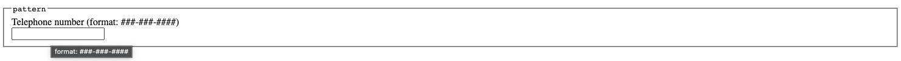
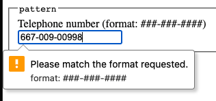

# Day 40 - Common input element attributes

Welcome to day 40!

Yesterday we covered the many, many input types that are available in HTML. Today we will cover the most common attributes that can be used on all, or most, of the input elements.

## `maxlength` and `minlength`

The `maxlength` and `minlength` attributes can be used to set the lower and upper limit of the number of characters that can be entered into an input element.

```html
<label for="tweet">Tweet (maximum of 144 characters)</label>
<input type="text" name="tweet" id="tweet" maxlength="144" />

<label for="user-password">Password (minimum of 16 characters)</label>
<input type="password" name="user-password" id="user-password" minlength="16" />
```

The reason I stated the limit or expectation in the label text is a means to improve the user experience. A user knows before hand what the expectations or limtations are on the input fields. If not provided, the user will only find out when they try to submit the form. This also aids user using assitive technologies.

The behavior of browsers with regards to `maxlength` and `minlength` is different. While input validation is done for `minlength` on form submission, the browser will automatically truncate the input value to the `maxlength`. Another reason why it is a good idea to provide a label with the expectation or limit.

### Valid input elements for `maxlength` and `minlength` attributes

You can use the `maxlength` and `minlength` attributes on the following input elements.

- text
- search
- url
- telephone
- email
- password

[Live on Codepen.io](https://codepen.io/schalkneethling/pen/8ffa77f203f6192282215dd6e69e9e3b?editors=1100)

## `size`

While the `maxlength` and `minlength` attributes are used to set the upper and lower limit of the number of characters that can be entered into an input element, the `size` attribute is used to set the width of the input element.

```html
<label for="firstname">First name</label>
<input type="text" name="firstname" id="firstname" size="12" />
```

### Valid input elements for the `size` attribute

You can use the `size` attribute on the following input elements.

- text
- search
- url
- telephone
- email
- password

[Live on Codepen.io](https://codepen.io/schalkneethling/pen/8ffa77f203f6192282215dd6e69e9e3b?editors=1100)

## `readonly`

As the name suggests, the `readonly` attribute is used to prevent the user from changing the value of an input element.

```html
<label for="username">Username</label>
<input
  type="text"
  name="username"
  id="username"
  value="schalkneethling"
  readonly
/>
```

### Valid input elements for the `readonly` attribute

You can use the `readonly` attribute on the following input elements.

- text
- search
- url
- telephone
- email
- password
- date
- month
- week
- time
- local-datetime
- number

## `required`

As the name suggests, the `required` attribute is used to mark an input element as required. A form will not submit untill all required fields have met their validation constraints.

```html
<label for="user-password">Password (required field)</label>
<input
  type="password"
  name="user-password"
  id="user-password"
  minlength="16"
  required
/>
```

Here again I include text in the label to clearly state that the field is required in order to improve the user experience for everyone. If you have a number of fields that are required, you do not have to repeat the text for each field, but can instead group the fields within a `fieldset` with a `legend` that states that all fields are required. For example:

```html
<fieldset>
  <legend>Account information (all fields are required)</legend>
  <label for="user-email">Email</label>
  <input type="email" name="user-email" id="user-email" required />
  <label for="username">Username (40 characters maximum)</label>
  <input type="text" name="username" id="username" maxlength="40" required />
  <label for="user-password">Password (minimum of 16 characters)</label>
  <input
    type="password"
    name="user-password"
    id="user-password"
    minlength="16"
    required
  />
</fieldset>
```

> NOTE: A screen reader will announce to the user that a field is required when focused. But again, until a user focuses a field, they will be none the wiser.

[Live on codepen.io](https://codepen.io/schalkneethling/pen/506261c5a65d0d3e096dc0ce5c5d8a10?editors=1100)

### Valid input elements for the `required` attribute

You can use the `required` attribute on the following input elements.

- text
- search
- url
- telephone
- email
- password
- date
- month
- week
- time
- local-datetime
- number
- checkbox
- radio button
- file upload

## `pattern`

The `pattern` attribute is used to specify a [regular experession](https://developer.mozilla.org/en-US/docs/Learn/Forms/Form_validation#validating_against_a_regular_expression) to run against the value of the input when the form is submitted. If the value does not conform to the constraints of the pattern, the browser will present a validation error message and not submit the form.

```html
<label for="telephone">Telephone number (format: ###-###-####)</label>
<input
  type="tel"
  name="telephone"
  id="telephone"
  pattern="[0-9]{3}-[0-9]{3}-[0-9]{4}"
/>
```

The above ensures that the number entered is in the format `###-###-####`(073-911-8334). Any other value will cause a validation error. Here again it is best practice to include text in the label to clearly state the constraints of the input.

### Validation with `title` on `input` element

You can also in addition include the pattern in a `title` attribute on the input element. When doing so, the pattern may be shown in a tooltip when the user hovers over the input element.

```html
<label for="telephone">Telephone number (format: ###-###-####)</label>
<input
  type="tel"
  name="telephone"
  id="telephone"
  pattern="[0-9]{3}-[0-9]{3}-[0-9]{4}"
  title="format: ###-###-####"
/>
```



The browser may also include it when displaying the validation error message.



> NOTE: A screen reader might read the text in the `title` attribute but, this is not to be relied upon.

### Valid input elements for the `pattern` attribute

You can use the `pattern` attribute on the following input elements.

- text
- search
- url
- telephone
- email
- password

[Live on Codepen.io](https://codepen.io/schalkneethling/pen/8ffa77f203f6192282215dd6e69e9e3b?editors=1100)

## `multiple`

I covered the `multiple` attribute when discussing the `email` and `file` input elements. I will therefore only recap here. In the case of `email` it allows a user to enter multiple email addresses separated with a comma. In the case of a `file` input, it allows the user to select and upload multiple files.

```html
<label for="filenames">Choose files</label>
<input type="file" id="filenames" name="filenames" multiple />

<label for="email-addresses">Email Address List</label>
<input type="email" name="email-addresses" id="email-addresses" multiple />
```

### Valid input elements for the `multiple` attribute

You can use the `multiple` attribute on the following input elements.

- email
- file

## `min` and `max`

I covered the `min` and `max` attributes when discussing the `date`, `number` and `range` inputs. I will therefore only recap here and provide some examples for ease of reference. In these instances it does not limit the number of characters but, it is used to set the upper and lower bounds of the input.

```html
<label for="start">Start date</label>
<input type="date" name="start" id="start" min="2020-01-01" max="2021-01-01" />
<p>
  The above field has a <code>min</code> date of 2020-01-01 and a
  <code>max</code> of 2021-01-01.
</p>

<label for="selected-month">Month</label>
<input
  type="month"
  name="selected-month"
  id="selected-month"
  min="2020-01"
  max="2020-10"
/>

<p>
  The above field constrains the moths to between Janurary and October of 2021.
</p>

<label for="selected-week">Week</label>
<input
  type="week"
  name="selected-week"
  id="selected-week"
  min="2021-W36"
  max="2021-W52"
/>

<p>
  The above field constrains the weeks to between the thirty-sixth and the
  fifty-second of the year 2021.
</p>

<label for="start-time">Choose a start time</label>
<input type="time" name="start-time" id="start-time" min="10:00" max="22:00" />
<p>The above field constrains the time to between 10 AM and 10 PM.</p>

<label for="local-time">Choose date and time</label>
<input
  type="datetime-local"
  name="local-time"
  id="local-time"
  min="2020-12-01T12:00"
  max="2021-10-31T12:00"
/>
<p>
  The above field constrains the date and time to between first of December 2020
  at 12 AM and the thirty-first of October 2021 at 12 AM.
</p>

<label for="quantity">Enter product quantity</label>
<input type="number" name="quantity" id="quantity" min="1" max="100" />
<p>The above field limits the number entered to between one and one hundred.</p>

<label for="estimate">Select range</label>
<input type="range" name="estimate" id="estimate" min="0" max="100" />
<p>The above field limits the range to between zero and one hundred.</p>
```

### Valid input elements for the `min` and `max` attributes

You can use the `min` and `max` attributes on the following input elements.

- date
- month
- week
- time
- number
- range

[Live on Codepen.io](https://codepen.io/schalkneethling/pen/cb6696f84771ede23c39e34fc26bb729?editors=1000)

## `step`

As with `min` and `max` I covered the `step` attribute when discussing the `date`, `number` and `range` inputs. I will therefore only recap here and provide some examples for ease of reference. The `step` attribute sets the increment or decrement of the input.

```html
<label for="start">Start date</label>
<input
  type="date"
  name="start"
  id="start"
  min="2020-01-01"
  max="2021-01-01"
  step="3"
/>
<p>
  For the <code>date</code> input type, the <code>step</code> increment is
  expressed in days defaulting to one.
</p>

<label for="selected-month">Month</label>
<input
  type="month"
  name="selected-month"
  id="selected-month"
  min="2020-01"
  max="2020-10"
  step="2"
/>

<p>
  For the <code>month</code> input type, the <code>step</code> increment is
  expressed in months defaulting to one.
</p>

<label for="selected-week">Week</label>
<input
  type="week"
  name="selected-week"
  id="selected-week"
  min="2021-W36"
  max="2021-W52"
  step="3"
/>

<p>
  For the <code>week</code> input type, the <code>step</code> increment is
  expressed in weeks defaulting to one.
</p>

<label for="start-time">Choose a start time</label>
<input
  type="time"
  name="start-time"
  id="start-time"
  min="10:00"
  max="22:00"
  step="120"
/>
<p>
  For the <code>time</code> input type, the <code>step</code> increment is
  expressed in seconds defaulting to sixty.
</p>

<label for="local-time">Choose date and time</label>
<input
  type="datetime-local"
  name="local-time"
  id="local-time"
  min="2020-12-01T12:00"
  max="2021-10-31T12:00"
  step="86400"
/>
<p>
  For the <code>datetime-local</code> input type, the
  <code>step</code> increment is expressed in seconds defaulting to sixty. In
  the above example the step is set to one day(86400 seconds).
</p>

<label for="quantity">Enter product quantity</label>
<input type="number" name="quantity" id="quantity" min="1" max="100" step="5" />
<p>
  For the <code>number</code> input type, the <code>step</code> increment is
  expressed as a number defaulting to one.
</p>

<label for="estimate">Select range</label>
<input type="range" name="estimate" id="estimate" min="0" max="100" step="20" />
<p>
  For the <code>range</code> input type, the <code>step</code> increment is
  expressed as a number defaulting to one.
</p>
```

### Valid input elements for the `step` attribute

You can use the `step` attribute on the following input elements.

- date
- month
- week
- time
- number
- range
