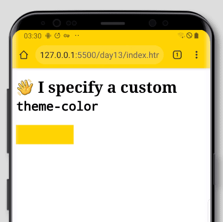

# Chapter 13 | The name attribute of the meta element

As mentioned in the previous chapter, in this chapter we will look at the various standard metadata names that can be used as the value of the `name` attribute of the `meta` element. 🎡

## `application-name`

The `application-name` meta name is to be used **only** when the current page represents a web application. The value should be a short free-form string. If your application name is localizable, you can specify translated names using the `lang` attribute.

```html
<meta
  name="application-name"
  content="The Drunk Monkey Name Generator"
  lang="en"
/>
<meta
  name="application-name"
  content="Der Drunk Monkey Name Generator"
  lang="de"
/>
<meta
  name="application-name"
  content="Le générateur de nom de singe ivre"
  lang="fr"
/>
```

There should only be one `application-name` entry for each unique language.

## `author`

A free-form string indicating the name of the author of the page.

```html
<meta name="author" content="Schalk Neethling" />
```

## `description`

A free-form string that provides a description for the current page suitable for display in a page directory i.e. a search engine. As with `application-name` there should only be one `description` per page.

```html
<meta
  name="description"
  content="A page about the standard meta names of the meta element"
/>
```

## `generator`

The `generator` meta name is to be used by software that generated the source of the webpage. If you are hand-coding your website or app, there is no need to specify `generator`, instead opt for `author`. On most Wordpress.com hosted sites for example you will find the following entry in the `head`:

```html
<meta name="generator" content="Wordpress.com" />
```

## `keywords`

The `keywords` meta name specifies a comma-separated list of keywords related to the content of the current page. Keywords along with the `description` meta name were the holy grail of SEO(Search Engine Optimisation) for the longest time. People spent hours fine-tuning the two pieces of meta information in the hopes of getting a better search ranking on sites such as Google.

Due to dark patterns that emerged such as keyword stuffing, most search engines these days ignore these keywords. You would get much better results by [focusing on the content of your site](https://searchengineland.com/guide/seo/html-code-search-engine-ranking) and a few of the other metadata elements such as `description` and the `title` element.

```html
<meta name="keywords" content="html, meta, meta names, standards, metadata" />
```

## `referrer`

We covered specifying a referrer policy earlier when we looked at the `referrerpolicy` attribute on the `link` element. Where the `referrerpolicy` on the `link` element specifies the policy for the specific linked resource in question, the `referrer` meta name specifies the policy for the current document.

```html
<meta name="referrer" content="origin-when-crossorigin" />
<meta name="referrer" content="origin-when-cross-origin" />
```

You will notice a subtle difference between the two lines above 😁 For a while `origin-when-cross-origin` was [mistakenly defined and shipped as `origin-when-crossorigin`](https://lists.w3.org/Archives/Public/public-webappsec/2015May/0064.html) and so, in order to ensure all browsers will understand your referrer policy, it is best to specify the legacy, as well as the new policy as above.

Because of the way browsers work, it will ignore the policy it does not understand and honor the one it does. Below is a list of how the [legacy policy names map to the new policies](https://html.spec.whatwg.org/#meta-referrer).

| Legacy value              | Referrer policy              |
| ------------------------- | ---------------------------- |
| `never`                   | `no-referrer`                |
| `default`                 | `no-referrer-when-downgrade` |
| `always`                  | `unsafe-url`                 |
| `origin-when-crossorigin` | `origin-when-cross-origin`   |

## `theme-color`

While `theme-color` is a standard meta name, support for it is very limited. At the time of writing it is only supported by Chromium-based browsers and only in the following scenarios:

1. On desktop when the website/app is installed as a progressive web app
2. On mobile but, only if the device does not have native dark mode enabled (although it seems this limitation does not apply to the Samsung Internet browser)

```html
<meta name="theme-color" content="#ffdd00" />
```

### Example of using the above with Chrome for Android



The above then covers the existing standard meta names at the time of writing. It is however possible to create an extension to the above list and, it is not a requirement to register these with the standards body [except for some specific cases](https://html.spec.whatwg.org/#other-metadata-names) where it is suggested. It is also important to note that there is a [wiki page listing current possible meta extensions](https://wiki.whatwg.org/wiki/MetaExtensions) in various states that should first be references to ensure an extension is not already being considered.

That’s a wrap for the `meta` element, in the next chapter we will move onto the `style` element. Until then, keep making the web awesome! 🧘‍♀️

### Related Reading

- [How to write meta descriptions for SEO (with good and bad examples)](https://www.searchenginewatch.com/2016/05/26/how-to-write-meta-descriptions-for-seo-with-good-and-bad-examples/)
- [Irrelevant keywords aka keyword stuffing](https://support.google.com/webmasters/answer/66358?hl=en)
- [Referrer Policy](https://w3c.github.io/webappsec-referrer-policy/)
- [`theme-color` support information on MDN Web Docs](https://developer.mozilla.org/en-US/docs/Web/HTML/Element/meta/name/theme-color#Browser_compatibility)
