# Chapter 31 - The (turns out) not so humble `img` element

In this chapter we cover the core element without which the `picture` and `source` elements would be rather useless. The humble `img` element. And much like the `link` element, oh boy has this element evolved. 🤯

## `img`

The `type` and `media` attributes make the combination of the `picture` element and its `source` element unique but, the `img` element has a couple of unique attributes all its own that is not to be ignored.

### `srcset`

When we looked at `srcset` with the `source` element we essentially used it as you would use `src` on the `img` element. The major functionality was driven by the attributes used with `srcset`. There is more you can do with this attribute though. Instead of just a single source, you can in fact specify a comma-separated list of image sources. Along with the image source, you can also specify either a width description or a pixel density descriptor.

To make this all clear, let’s look at some examples. First up let’s look at using a pixel density descriptor.

> NOTE: As with the other examples we are going to use the browser developer tools to simulate the various environments.

```html

```

> Photo by [Trevor Gerzen](https://unsplash.com/@tgerz?utm_source=unsplash&utm_medium=referral&utm_content=creditCopyText) on [Unsplash](https://unsplash.com/s/photos/surfer?utm_source=unsplash&utm_medium=referral&utm_content=creditCopyText)

> NOTE: With regards to the two images specified in `srcset`. They are the exact same image but, the image called `pixel-density@2x.png` is double the intrinsic width and height of the other image. So, while `pixel-density.png` is 500x500 pixels, the other is 1000x1000px. Even though the `2x` image is twice the intrinsic size, we scale it down to the same width and height. We do this to essentially squeeze more pixels into the same image dimensions. On displays with a higher pixel density, that should result in higher quality and crisper images.

### Live Codepen - Using `srcset` with the `img` element



To experiment with the above [open this link in your browser](https://codepen.io/schalkneethling/live/ff0c07969c63c17284e8c94f5d02daeb), open up the developer tools, and enable responsive/device mode.

### Adding high and normal DPR devices

We need to take a quick detour. To test the above you will need to change the config a little to enable or add high and normal DPR(Device Pixel Ratio) devices.

#### Chrome

With the developer tools open and in device mode, click on the options menu at the top right:

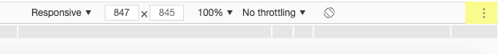

An options menu will open. Click "Add device pixel ratio".

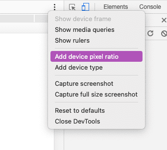

You will now see the DPR select dropdown added to the toolbar.


#### Firefox

With the developer tools open and in responsive mode, click on the devices menu:


In the menu that opens, click the "Edit list" option.

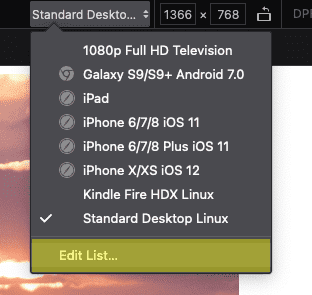

This will open the "Device Settings" menu dialog.

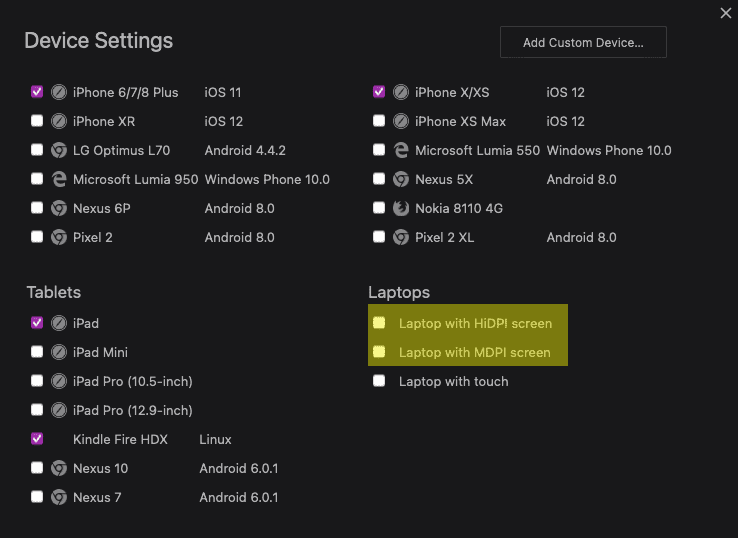

Enable the two highlighted items(Laptop with HiDPI screen and Laptop with MDPI screen) and close the device settings dialog.

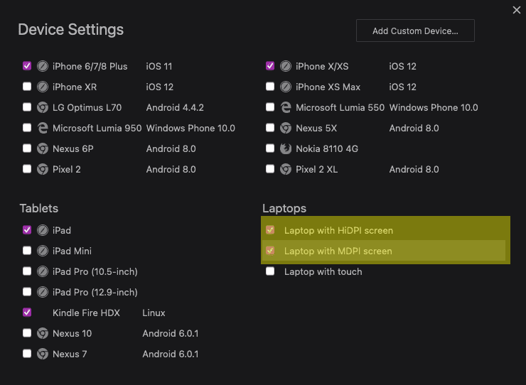

With the above configured in your preferred browser, we are ready to test that our `srcset` works as expected. In Chrome set the DPR to 1. If you are using Firefox, select the "Laptop with MDPI screen" option from the devices menu. Ensure the network panel is active in dev tools and set the filter to only show "Images".

**In Chrome**

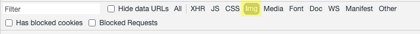

**In Firefox**


Reload the example page.

In Firefox you should see the following in the network panel:

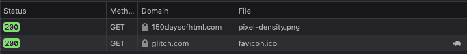

And in Chrome:

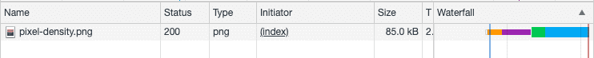

Now set the DPR to 2, or select "Laptop with HiDPI screen" and reload the page. In Firefox you should see the following in the network panel:


And in Chrome:

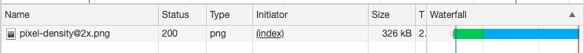

The second use-case for `srcset` on the `img` we will cover as part of the `sizes` attribute as they work hand in hand.

### `sizes`

In the above example, we specified a pixel density descriptor as part of the source image URL in our `srcset` attribute. We also scaled the images to the same intrinsic width. Here we will look at the other option, specifying a width descriptor. When specifying a width descriptor, you also need to specify the `sizes` attribute. Here we intend for the images to be of different intrinsic sizes based on a media query.

Also, note that the width descriptor is the intrinsic width of the image plus a `w`. No other unit such as for example `px` is valid here.

```html

```

**NOTE:** Even though not specified here, the device pixel ratio plays a role in which image the user agent will choose. For example, if you load the above image on a device with a max-width of `20em` but with a DPR of 2, the user agent will choose `sizes-768.png`. If you want to ensure that on devices with a max-width of `20em`(~320px) the smallest possible image is loaded, you also need to specify the DPR, for example:

```html

```

### Live Codepen - Using the `img` element with `srcset` and `sizes`



To experiment with the above [open this link in your browser](https://codepen.io/schalkneethling/live/bce938b27a0ff1a13e4f4ac3c3c5b75b), open up the developer tools, and enable responsive/device mode.

With the above change, loading the example in a browser window with a width of 320px and a DPR of 1 will result in the browser loading `sizes-320.png`.

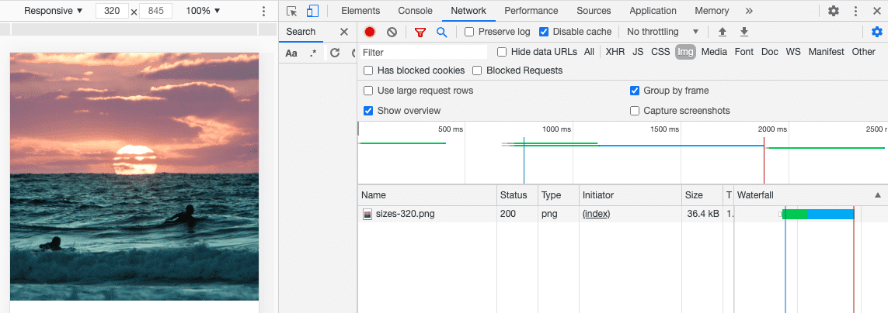

Because the other media queries do not specify a DPR we can simply resize the viewport to see the new images load.

At a width of 768px:

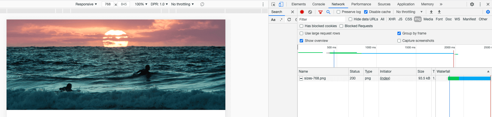

At a width of 1024px:

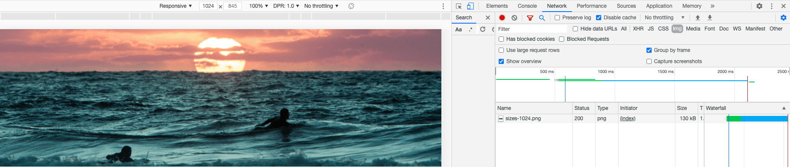

And of course, if you want to load the smallest image even if the device has a DPR of 2, you would change the media query to the following:

```html

```

### `alt`

You already saw its use in the examples above. It is a means to provide a textual description of the image or media asset being displayed. This will be displayed if the image fails to load but, is also read aloud by screen reader software and is therefore essential for accessibility.

With that said, if the image you are displaying is purely decorative, then you should specify the `alt` attribute with an empty value.

```html

```

When a screen reader encounters an image with an empty `alt` attribute, it will treat it as if the ARIA role of presentation has been applied and not announce the image to the user. Another detail to be aware of is that when you do provide alternative text for an image, the screen reader software will announce the image as an image and so, there is no need to restate that fact.

```html
<!-- instead of -->

<!-- you would write -->

```

Also, while it is important to be descriptive, avoid being overly verbose.

### `crossorigin`

This is a pretty advanced use case attribute but the gist of its use is as follows:

If you load an image with the intent to use the image data inside a [`canvas` element](https://developer.mozilla.org/en-US/docs/Web/HTML/Element/canvas) you need to specify the `crossorigin` attribute. If you either do not specify `crossorigin` or, you do specify it and the server does not opt into allowing cross-origin access, the browser will [mark the image as tainted](https://developer.mozilla.org/en-US/docs/Web/HTML/CORS_enabled_image), and disallow usage of the image data in the `canvas` element.

### `usemap`

We will look at this in more detail when we look at the `map` and `area` elements but, the `usemap` attribute is what allows you to associate the current `img` element with an image map.

From the [HTML specification](https://html.spec.whatwg.org/#attr-hyperlink-usemap):

```html

```

### `ismap`

There really is not much to say about this other than that it is still a supported attribute but, that the underlying technology, [server-side image maps](https://accessibilityinsights.io/info-examples/web/server-side-image-map/), are not something that you are likely to encounter today or should use. It is a boolean attribute and can only be used if the `img` element has an ancestor anchor element with a valid `href` attribute that points to a fallback destination.

### `referrerpolicy`

We have encountered this attribute on a few elements already. As with the other elements, it is a means to [specify the referrer policy](https://developer.mozilla.org/en-US/docs/Web/HTML/Element/img#attr-referrerpolicy) to use when fetching the resource.

```html

```

### `decoding`

This is one of the more useful attributes of the `img` element. This along with the next couple of attributes are all about performance and user experience. The default behavior of a user agent is to decide on a decoding strategy that is best for the user. However, if you know that the image is not critical to the overall content of the page or, that it will be loaded [below the fold](https://www.wordstream.com/below-the-fold), you might want to explicitly provide a hint to the browser to defer decoding until later.

The attribute can have one of three values, `sync`, `async`, `auto`(the default).

```html

```

### `loading`

This attribute has two possible values, `eager`(the default), and `lazy`. Here again, if you know that the image will be loaded below the fold, you might opt to set the image to load lazily.

```html

```

You can of course be pretty aggressive here and specify both `loading` and `decoding`.

```html

```

An important [note about the `loading` attribute](https://developer.mozilla.org/en-US/docs/Web/HTML/Element/img) from MDN Web Docs:

> Loading is only deferred when JavaScript is enabled. This is an anti-tracking measure, because if a user agent supported lazy loading when scripting is disabled, it would still be possible for a site to track a user's approximate scroll position throughout a session, by strategically placing images in a page's markup such that a server can track how many images are requested and when.

These two attributes are really powerful tools but always test your pages and use these wisely. Overuse can actually decrease the user experience.

### `width` and `height`

While common between the `source` and `img` elements, their importance cannot be ignored. If you do not set these attributes for an image, a browser has no idea how much visual space to afford to the image until it has fetched and decoded the image data. This leads to what is now termed, [cumulative layout shift(CLS)](https://web.dev/cls/) and is part of what is known as the [Core Web Vitals](https://web.dev/vitals/).

A quote from the article linked above:

> Web Vitals is an initiative by Google to provide unified guidance for quality signals that are essential to delivering a great user experience on the web.

These are therefore critical to user experience and SEO, and should not be ignored or taken likely. As I mentioned at the start, the `img` element has evolved a lot and truly offers us some amazingly powerful features that previously required both CSS and JavaScript to achieve. Pretty humbling to see how the web platform is evolving is it not?

### Related reading

- [What Were Server-Side Image Maps?](https://www.rickcarlino.com/2021/03/02/what-were-server-side-image-maps-html.html)
