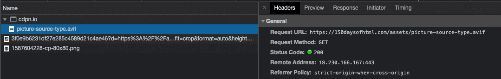
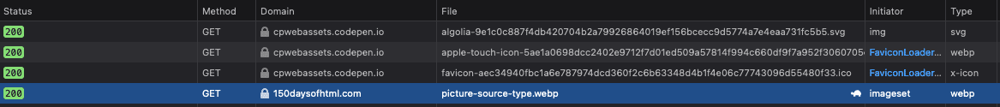

# Day 30 - Embedded content - Images

Welcome to day 30!

Today we start to dig into the embdeded content elements. The elements we cover today are, `picture`, `source`, and `img`. Together these three elements provides a way to display visual content to our users. Though you only _need_ the `img` element, the `picture` element, introduced with HTML5, and its related `source` element give us additional control over which image is shown to our users.

## `picture`

The `picture` element is merely a container element and does not display anything by itself. It is a container for zero or more `source` elements and one `img` element. So what is the difference between using the `picture` element or merely using an `img` element by itself? With the `img` element you specify a single source image that is displayed no matter the user’s environment and support for the specific image format. There are of course ways to manipulate the source image through JavaScript, but what if the browser could do the heavy lifting for us based on its knowledge of the environment and user preferences?

That is then where the `picture` element comes in. Instead of just our single `img` element, we can specify multiple source images along with some hints to the browser about when to use which source.

## `source`

As with `picture` the `source` element by itself does not represent anything. The `source` element can also be used with other elements such as the `video` and `audio` elements. Today we will focus on its use with the `picture` element. As hinted at above, we will use the `source` element to provide additional source options for the `img` element contained within the parent `picture` element. With that said, it is not the exclusive domain of the `source` element to enable multiple sources, this can also be achieved with just the `img` element. There are some differences though that will guide your choice in using just the `img` element or, using the `picture` element with `source` and `img`.

Attributes shared by the `source` element and the `img` element are:

- srcset
- sizes
- width
- height

Technically they also share the `src` attribute but it is only valid when `source` is used with either the `video` or `audio` element. the attributes unique to `source` are:

- type
- media

### `type`

The `type` attribute allows you to specify the type of media asset you are referencing with the `source` element. Why is this useful?

It used to be that we had only essentially two widely supported image formats on the web. Those being [GIF(Graphics Interchange Format)](https://en.wikipedia.org/wiki/GIF) and [JPEG(Joint Photographics Experts Group)](https://en.wikipedia.org/wiki/JPEG). Later on we also got support for the [PNG(Portable Network Graphics)](https://en.wikipedia.org/wiki/Portable_Network_Graphics) image format that is widely used on the web today.

Things have not stood still though and recently(roughly around 2018) [Webp](https://en.wikipedia.org/wiki/WebP) developed by Google was introduced. The latest addition to image formats on the web is [AVIF](<https://en.wikipedia.org/wiki/AV1#AV1_Image_File_Format_(AVIF)>) with [growing support across user agents](https://avif.io/).

With the `type` attribute we can take advantage of these new formats and offer users faster loading pages but, still provide fallbacks for those browsers that do not support the newer image formats.

```html
<picture>
  <source
    srcset="https://150daysofhtml.com/assets/picture-source-type.avif"
    type="image/avif"
  />
  <source
    srcset="https://150daysofhtml.com/assets/picture-source-type.webp"
    type="image/webp"
  />
  
</picture>
```

When loading the below example in Chrome and look in the network panel of the developer tools you will see that Chrome loads the AVIF file format:



Opening the same example in Firefox demonstrates how it falls back to WebP format:



As you will also see in the example, there is a significant difference in the file size of the various formats. As performance is a large part of the user experience and accessibility, this is a great tool to have in your aresenal.

- AVIF - 69kb
- Webp - 88kb
- PNG - 214kb

[See the live example on Codepen.io](https://codepen.io/schalkneethling/pen/eYvZPgL)

### `media`

The other use case where you would choose `picture` over just `img` is when used with the `media` attribute. As with the `link` element, the `media` attribute can be used to specify a [media query](https://developer.mozilla.org/en-US/docs/Learn/CSS/CSS_layout/Media_queries). The browser will then load the image whose media query most closely matches the current environment starting from the top and moving on until it reaches the `img` element.

```html
<picture>
  <!-- The below image and dimensions will be used up to a max viewport width of ~320px -->
  <source
    srcset="https://placekitten.com/g/300/300"
    media="screen and (max-width:20em)"
    width="300"
    height="300"
  />
  <!-- The below image and dimensions will be used up to a max viewport width of ~1024px -->
  <source
    srcset="https://placekitten.com/g/400/500"
    media="screen and (max-width:64em)"
    width="400"
    height="500"
  />
  <!-- The below image and dimensions will be used for viewports larger than ~1024px -->
  
</picture>
```

When you open the example below also open up your browsers developer tools and switch it to responsive mode([Chrome How-To](https://developer.chrome.com/docs/devtools/device-mode/) - [Firefox How-To](https://developer.mozilla.org/en-US/docs/Tools/Responsive_Design_Mode)). As you switch between small mobile (320px viewport size or smaller), tablet, and desktop, you will notice that differently sized images load. Not only are the images smaller on smaller viewports, but we also specify different aspects ratios. This is what is [commonly known as art direction](https://uxdesign.cc/how-art-direction-will-help-you-create-masterful-web-interfaces-cba8d3dab0d8) and is a common use case for the `picture` element.

[See the live example on Codepen.io](https://codepen.io/schalkneethling/full/ExWKOLg)

To see the above example along with the source code, [use this link](https://codepen.io/schalkneethling/pen/ExWKOLg).

Before we move on to the `img` element, you might be saying, "Hold on, you said the `source` element does not represent anything visually but in the examples above it does?". Looking at the second example, what really happens is something like the following.

1. The browser encounters the `picture` element and looks for its first child element.
2. It finds the `source` element and starts to look at its attributes.
3. When it encounters the `media` attribute, it parses its value. Seeing that what we specified is a valid media query string, it executes it against the current environment.
4. Let’s assume it matched.
5. It now looks for its child `img` element.
6. It then replaces the `src` attribute value with the value from the `source` element that matched the environment. Seeing that we also specified a width and height, it also copies over those values and renders the `img` element. And walla! 🎉 😀

## `img`

The `type` and `media` attributes makes the combination of the `picture` element and its `source` element unique but, the `img` element has a couple of unique attributes all its own that is not to be ignored.

### `srcset`

When we looked at `srcset` with the `source` element we essentially used it as you would use `src` on the `img` element. The major functionality was driven by the attributes used with `srcset`. There is more you can do with this attribute though. Instead of just a single source, you can in fact specify a comma separated list of image sources. Along with the image source, you can also specify either an width description or a pixel density descriptor.

To make this all clear, let’s look at some examples. First up let’s look at using a pixel density descriptor.

> NOTE: As with the other examples we are going to use the browser developer tools to simulate the various environments.

```html

```

### `sizes`

### `alt`

You already saw its use in the examples above. It is a means to provide a textual description of the image or media asset being displayed. This will be displayed if the image fails to load but, is also read aloud by screen reader software and is therefore essential for accessibility.

With that said, if the image you are displaying is purely decorative, then you should specify the `alt1 attribute with an empty value.

```html

```

When a screen reader encounters an image with an empty `alt` attribute, it will treat it as if the ARIA role of presentation has been applied and not announce the image to the user. Another detail to be aware of is that when you do provide alternative text for an image, the screen reader software will announce the image as an image and so, there is no need to restate that fact.

```html
<!-- instead of -->

<!-- you would write -->

```

Also, while it is important to be descriptive, avoid being overly verbose.

### `crossorigin`

This is a pretty advanced use case attribute but the gist of its use is as follows:

If you load an image with the intent to use the image data inside a [`canvas` element](https://developer.mozilla.org/en-US/docs/Web/HTML/Element/canvas) you need to specify the `crossorigin` attribute. If you either do not specify `crossorigin` or, you do specify it but the server does not opt into allowing cross-origin access, the browser will [mark the image as tainted](https://developer.mozilla.org/en-US/docs/Web/HTML/CORS_enabled_image), and disallow usage of the image data in the `canvas` element.

### `usemap`

We will look at this in more detail when we look at the `map` and `area` elements but, the `usemap` attribute is what allows you to associate the current `img` element with an image map.

From the [HTML specification](https://html.spec.whatwg.org/#attr-hyperlink-usemap):

```html

```

### `ismap`

There really is not much to say about this other than that it is still a supported attribute but, that the underlying technology, [server-side image maps](https://accessibilityinsights.io/info-examples/web/server-side-image-map/), are not something that you are likely to encounter today or should use. It is a boolean attribute and can only be used if the `img` element has an ancestor anchor element with a valid `href` attribute that points to a fallback destination.

### `referrerpolicy`

We have encountered this attribute on a few elements already. As with the other elements, it is a means to [specify the referrer policy](https://developer.mozilla.org/en-US/docs/Web/HTML/Element/img#attr-referrerpolicy) to use when fetching the resource.

```html

```

### `decoding`

This is one of the more useful attributes of the `img` element. This along with the next couple of attributes are all about performance and user experience. The default behavior of a user agent is to decide on a decoding strategy that is best for the user. However, if you know that the image is not critical to the overall content of the page or, that it will be loaded [below the fold](https://www.wordstream.com/below-the-fold), you might want to explicitly provide a hint to the browser to defer decoding until later.

The attribute can have one of three values, `sync`, `async`, `auto`(the default).

```html

```

### `loading`

This attribute has to possible values, `eager`(the default), and `lazy`. Here again, if you know that the image will be loaded below the fold, you might opt to set the image to load lazily.

```html

```

You can of course be pretty agressive here and specify both `loading` and `decoding`.

```html

```

An important [note about the `loading` attribute](https://developer.mozilla.org/en-US/docs/Web/HTML/Element/img) from MDN Web Docs:

> Loading is only deferred when JavaScript is enabled. This is an anti-tracking measure, because if a user agent supported lazy loading when scripting is disabled, it would still be possible for a site to track a user's approximate scroll position throughout a session, by strategically placing images in a page's markup such that a server can track how many images are requested and when.

These two attributes are really powerful tools but always test your pages and use these wisely. Overuse can actually decrease the user experience.

### `width` and `height`

While common between the `source` and `img` elements, their importance cannot be ignored. If you do not set these attributes for an image, a browser has no idea how much visual space to afford to the image until it has fetched and decoded the image data. This leads to what is now termed, [cumulative layout shift(CLS)](https://web.dev/cls/) and is part of what is known as the [Core Web Vitals](https://web.dev/vitals/).

A quote from the article linked above:

> Web Vitals is an initiative by Google to provide unified guidance for quality signals that are essential to delivering a great user experience on the web.

These are therefore critical to user experience and SEO, and should not be ignored or taken likely. That then covers the majority of the most important aspects of these elements. We will encounter the `source` element again when we look at the `video` and `audio` elements.

### Related reading

- [Media formats - Image types](https://developer.mozilla.org/en-US/docs/Web/Media/Formats/Image_types)
- [Webponize - Convert images to Webp - macOS](https://webponize.org/)
- [AVIF](https://avif.io/)
- [WebP](https://developers.google.com/speed/webp)
- [CSS-Tricks' Complete guide to CSS media queries](https://css-tricks.com/a-complete-guide-to-css-media-queries/)
- [What Were Server-Side Image Maps?](https://www.rickcarlino.com/2021/03/02/what-were-server-side-image-maps-html.html)

Until tomorrow, keep making the web awesome!

~..~ Schalk Neethling - [@schalkneethling](https://twitter.com/schalkneethling) pretty much everywhere :)
