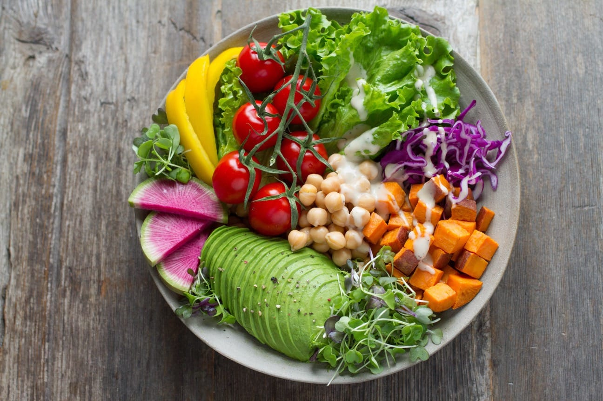

# Day 35 - Map, area, MathML, and SVG

Welcome to day 35!

Today we conclude our look at the embedded content elements. Today is a little different in that we will look at two elements, and then two other "elements" that are part of the embedded content group but, are each so large that you can dedicate an entire newsletter to each. We will therefore take a very high-level look at those and I will then provide links to further reading on both topics.

With all of that said, let’s digg into the `map` element.

## `map`

The `map` by itself is merely a container for what is known as an [image map](https://html.spec.whatwg.org/#image-map). It is used in conjunction with an `img` element and an `area` element. It inherits all of the [global attributes](https://html.spec.whatwg.org/#global-attributes) and uses the `name` attribute to uniquely identify the `map`. The value of the `name` attribute is used by the `img` element to reference the image map as we will see in a bit.

> NOTE: If you also specify an `id` attribute on the `map` element, its value should be the same as the value used for the `name` attribute.

```html

<map name="vegetables"></map>
```

Photo by [Anna Pelzer](https://unsplash.com/@annapelzer?utm_source=unsplash&utm_medium=referral&utm_content=creditCopyText on [Unsplash](https://unsplash.com/s/photos/vegetable?utm_source=unsplash&utm_medium=referral&utm_content=creditCopyText)

[See the live example on Codepen.io.](https://codepen.io/schalkneethling/pen/oNZybyx)

When you open the example above you will see that, at this point, we are essentially just loading an image. We have created an association between the `img` element and the `map` element, but nothing meaningful is happening just yet.

## `area`

This is where the `area` attribute comes into play. When the `area` element has an `href` property, it is assigned the implicit [ARIA role of `link`](https://w3c.github.io/html-aria/#el-area) which is the same as the `a`(anchor) element. The `area` element has a number of attributes most of which we have dealt with before but, it has two new attributes. We will start be looking at these.

### `shape`

The `shape` attribute has 4 possible values: `circle`, `default`, `poly`, and `rect`. If the attribute is omitted, it defaults to `rect`.

```html

<map name="vegetables">
  <!-- defaults to rect -->
  <area />
  <area shape="circle" />
  <area shape="rect" />
  <area shape="poly" />
</map>
```

### `coords`

With the intended shape defined by the `shape` attribute, we now use `coords` to specify the, well, coordinates where this shape is to be drawn on the image.

#### `circle`

In the circle state the value of `coords` must contain 3 comma-separated values. The first is the distance, in pixels, from the left edge of the image. The second, is the distance, in pixels, from the top edge of the image, and the third, is the radius of the circle in pixels.


```html

<map name="vegetables">
  <area shape="circle" coords="750, 480, 120" />
  <area shape="rect" coords="350, 100, 500, 400" />
</map>
```

#### `rect`

In the `rect` state the value of `coords` must contain 4 comma-separated values. The first must be less than the third. The second must be less than the fourth.

- The first is the distance from the left edge of the image to the left edge of the `rect`
- The second is the distance from the top edge of the image to the top edge of the `rect`
- The third is the distance from the left edge of the image to the right edge of the `rect`
- The fourth is the distance from the top edge of the image to the bottom edge of the `rect`


```html

<map name="vegetables">
  <area shape="circle" coords="750, 480, 120" />
  <area shape="rect" coords="350, 100, 500, 400" />
</map>
```

#### `poly`

In the `poly` state the value of `coords` must contain at least 6 comma-separated values. You can specify more than 6, but the total number must always be even. Each pair must specify the distance from the left and top of the image respectively in pixels.

```html

<map name="vegetables">
  <area shape="circle" coords="750, 480, 120" />
  <area shape="rect" coords="350, 100, 500, 400" />
  <area
    shape="poly"
    coords="599, 112, 673, 15, 859, 46, 971, 155, 986, 236, 816, 298, 672, 286"
  />
</map>
```


#### `default`

In the `default` state the area is the entirety of the image and the `coords` attribute should not contain any values.

### `href`

At this point we have associated a `map` with an `img` and defined some areas on that `img` but, it serves no purpose yet. With the `href` attribute, we can link a specific area to a destination and turn the `area` into a hyperlink.

```html

<map name="vegetables">
  <area
    shape="circle"
    coords="750, 480, 120"
    href="https://en.wikipedia.org/wiki/Chickpea"
  />
  <area
    shape="rect"
    coords="350, 100, 500, 400"
    href="https://en.wikipedia.org/wiki/Bell_pepper"
  />
  <area
    shape="poly"
    coords="599, 112, 673, 15, 859, 46, 971, 155, 986, 236, 816, 298, 672, 286"
    href="https://en.wikipedia.org/wiki/Lettuce"
  />
</map>
```

[See the live example on Codepen.io.](https://codepen.io/schalkneethling/pen/oNZybyx)

Open the above example and hover your mouse pointer over different areas of the image(hint: look at the value of the `href` attribute to get a sense of where the areas are 😀). As you hover over for example the chickpeas, you will notice that your mouse pointer changes into the common pointer icon you are used to see for hyperlinks. When you click this area, it will navigate to the URL as expected.

### `target`

The `target` attribute here behaves and takes the [exact same values](https://html.spec.whatwg.org/#valid-browsing-context-name-or-keyword) as we have encountered with other elements.

```html

<map name="vegetables">
  <area
    shape="circle"
    coords="750, 480, 120"
    href="https://en.wikipedia.org/wiki/Chickpea"
    target="_blank"
  />
  <area
    shape="rect"
    coords="350, 100, 500, 400"
    href="https://en.wikipedia.org/wiki/Bell_pepper"
    target="_blank"
  />
  <area
    shape="poly"
    coords="599, 112, 673, 15, 859, 46, 971, 155, 986, 236, 816, 298, 672, 286"
    href="https://en.wikipedia.org/wiki/Lettuce"
    target="_blank"
  />
</map>
```

All the `area` hyperlinks will now open in a new tab or window.

[See the live example on Codepen.io.](https://codepen.io/schalkneethling/pen/oNZybyx)

### `download`

This is another attribute we have encountered before, and as before, has the same meaning and functionality. It indicates to the user-agent that the author intends for the URL the `href` points to, to be a downloadable resource. You can either simply add the attribute with no value or with a value specified. If a value is specified, it will be used for the filename of the downloaded resource.

```html

<map name="vegetables">
  <area
    shape="circle"
    coords="750, 480, 120"
    href="https://en.wikipedia.org/wiki/Chickpea"
    target="_blank"
  />
  <area
    shape="rect"
    coords="350, 100, 500, 400"
    href="https://en.wikipedia.org/wiki/Bell_pepper"
    target="_blank"
  />
  <area
    shape="poly"
    coords="599, 112, 673, 15, 859, 46, 971, 155, 986, 236, 816, 298, 672, 286"
    href="https://en.wikipedia.org/wiki/Lettuce"
    target="_blank"
  />
  <area
    shape="poly"
    coords="427, 621, 449, 506, 531, 491, 747, 589, 750, 666, 656, 786"
    href="https://loveonetoday.com/wp-content/uploads/2017/07/Love-One-Today-Nutrition-Facts-Label.pdf"
    download="avocado-nutrition-facts.pdf"
  />
</map>
```

### Related reading

- [Online Image Map Editor](http://maschek.hu/imagemap/imgmap/)
